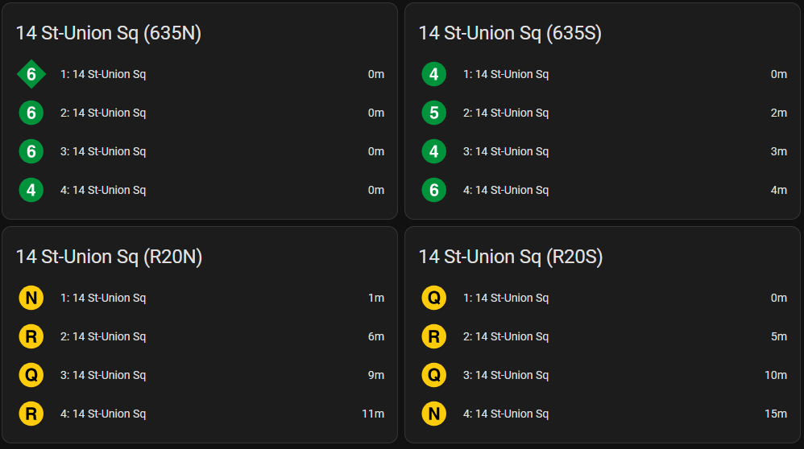

# GTFS Realtime for Home Assistant

## Installation

This integration can be installed manually or through [HACS](https://hacs.xyz/).

#### HACS

This repository is now included in HACS's defaults.

#### Manual

Copy files in [custom_components/gtfs_realtime](custom_components/gtfs_realtime/) to [/path/to/homeassistant/config/custom_components/gtfs_realtime](#).

## Configuration

Once the integration is installed, the configure the integration through Settings >> Devices and Services, and use "Add Integration".  Select GTFS Realtime and follow the instructions in the user interface.

You can select a supported provider or configure it manually. A number of GTFS providers are included for convenience in this repository.  

There is no guarantee that these providers will continue to work with this integration.  A [GitHub Action Workflow](https://github.com/bcpearce/homeassistant-gtfs-realtime/actions/workflows/feed_compatibility.yaml) runs to check the status of each feed. 

### Realtime Feed URLs

These are the URLs that will be queried for realtime updates. Using a preconfigured provider may include feeds you do not need, these can be deleted here to improve performance. Note that static feeds are *also* required alongside realtime feeds for full schedule information such as destination headsigns and route IDs. 

### Static Feed URLs

Less frequently updated data will be provided as one or more .zip files. Include the URL your provider supplies these files at. It is updated less frequently, and can be customized to match the release rate of your provider. 

### API Key

If your provider requires an API Key, it can be included as a header field for HTTP requests. It should be given in the format expected by your provider. Hints with placeholders are provided for preconfigured feeds that require authentication. 

In some cases, the API key might be provided as a URL parameter, in this case you should update the feed URL for the feed to include it. 

### Route Icons

Optionally route icons can be included.  The integration will default to using MDI icons otherwise. For NYC Subway integrations, and other supported integrations, the resources folder may contain valid route icons to use.  

For custom use, a URL must be provided that includes up to three Python format braces for `{route_id}`, `{route_color}` and `{route_text_color}`. At minimum, `{route_id}` must be provided.  These braces should be placed in the input string and conform to the requirements in Python'a [str.format()](https://docs.python.org/3/library/stdtypes.html#str.format) method. 

#### Resources

The [resources/NYCT_Bullets](resources/NYCT_Bullets/) folder contains ready-to-use SVG files for customizing arrival icons for the New York City Subway, provided by Wikimedia Commons.

### Other Transit Systems

This software may work for other GTFS realtime providers, but has not been tested. There is no guarantee that providers--even if included in this repository--will work--or that changes in provider APIs will not cause breakages. 

## Frontend

Example frontend card configs can be found in [example/frontend.yaml](example/frontend.yaml).

Simply displaying all entities for a "stop" device provides a train arrival board.

## Sensors

### Arrival Sensor

The number of sensors can be specified during setup. By default this is 4.  

Sensors will indicate the 1st, 2nd, 3rd, ... etc. arrivals for a given `stop_id` ordered by shortest time.  If no scheduled trips exist for a given arrival ordinal, it will take on the state "Unknown". That is to say, the first sensor will always have the shortest time to arrival, the second sensor will have the second shortest time to arrival, and so on. 

Raw sensor data is provided in seconds. Minutes are the recommended unit.

### Alert Sensor

Alert sensors can be setup for a `route_id`. The [example/frontend.yaml](example/frontend.yaml) file shows how to set up conditional cards that display only if an alert is active. The alert sensor will switch to the "Problem" state if an alert is active for a given station or route. This can be used in automations, such as turning on an indicator LED when an alert becomes active. 

## Devices

Each stop will collect the arrival sensors together as a device. For each static data collection, a device is also included for managing the schedule updates.

## Services

Services are provided for updating and clearing the static data schedule. During setup, an interval for refreshing this data can be provided.

## GTFS Station Stop

This package utilizes [GTFS Station Stop](https://pypi.org/project/gtfs-station-stop/) to provide updates to Home Assistant sensors. 

## Disclaimer

This software is not developed with or affiliated with Home Assistant or with any GTFS API provider. It is not guaranteed to work, use at your own risk. 
